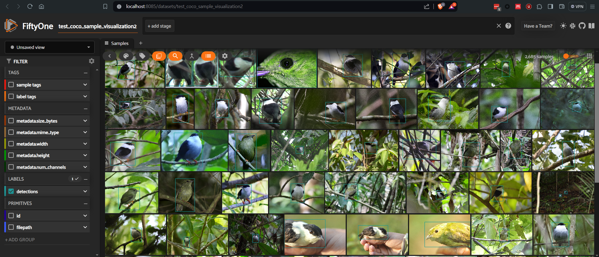
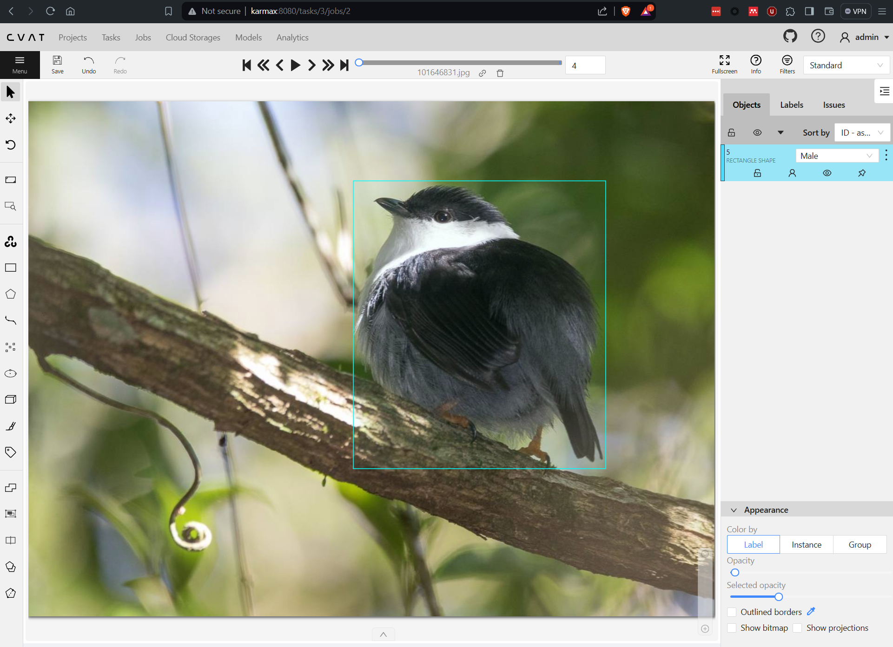
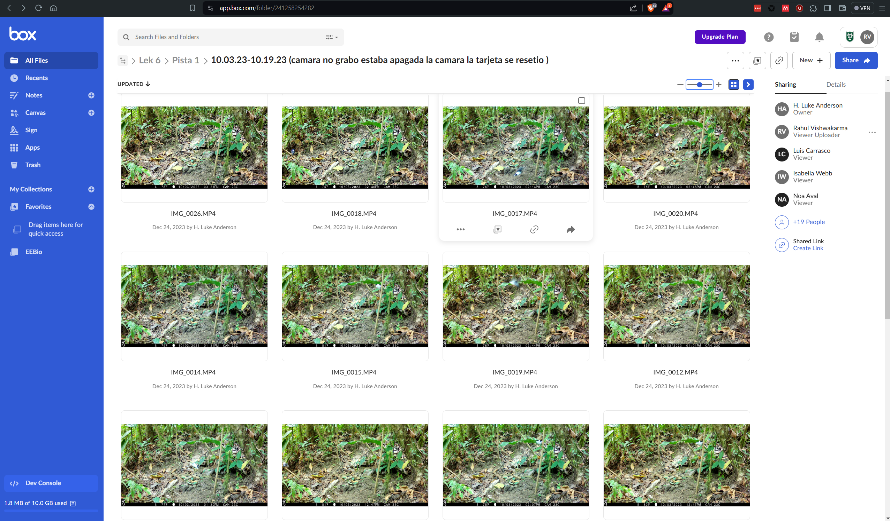

# Dataset 


### (1.) eBird Dataset

- 
- Download the `Manacus manacus` images dataset from https://support.ebird.org/en/support/solutions/articles/48000838205-download-ebird-data 
- Credit the dataset as per provided guidance at https://support.ebird.org/en/support/solutions/articles/48001064570-crediting-media
- Split the images data for model train, val, test using [./ebird/dataset_split.py](./ebird/dataset_split.py) [`Deprecated`]
- Cocofy the dataset for an initial label with fixed bounding box that can leter be adjusted [./ebird/dataset_cocofy.py](./ebird/dataset_cocofy.py)
- Visualize this dataset using standalone FiftyOne app [./ebird/dataset_visualize.py](./ebird/dataset_visualize.py)
    - 
- Annotate this dataset in CVAT and export labels for training 
    - Import the cocofied labels into CVAT upon creating task with 3352 images
    - 
    - [TODO] Label the high resolution images with support from Luke Anderson and experts - http://vader.ece.ucsb.edu:8080/projects/4
    - Split the COCO train, val, test sets using [./ebird/coco/dataset_cocofy.py](./ebird/coco/dataset_cocofy.py)
        - Keeping the category labels balanced 
        ```bash
        $python dataset_cocofy.py
        Total annotations 3372, images 3352
        Copied 2689 train images
        [[   1 1881]
        [   2  788]
        [   3   40]]
        Saved Train 2709 entries in annotations/train.json
        Remaining annotations for val/test split - annotations 3372, images 3352
        Copied 337 val images
        [[  1 238]
        [  2  99]
        [  3   5]]
        Saved Val 342 entries in annotations/val.json
        Copied 337 test images
        [[  1 234]
        [  2 105]
        [  3   6]]
        Saved Test 345 entries in annotations/test.json
        ```
    - Convert COCO to Yolo using [./ebird/yolo/dataset_yolofy.py](./ebird/yolo/dataset_yolofy.py)
        ```bash
        $python dataset_yolofy.py
        Annotations ../coco/annotations/train.json: 100%|████████████| 2689/2689 [00:00<00:00, 44302.32it/s]
        2689it [00:01, 1344.84it/s]
        Annotations ../coco/annotations/val.json: 100%|██████████████| 337/337 [00:00<00:00, 44703.52it/s]
        337it [00:00, 1292.67it/s]
        Annotations ../coco/annotations/test.json: 100%|█████████████| 337/337 [00:00<00:00, 42917.27it/s]
        337it [00:00, 1362.18it/s]
        ``` 

---

### (2.) FCAT Dataset 
- Search the Box folder approach and explore the respository
    - 
    - Download the ["Camera Traps 1 -- Dec 2021 to Jan 2022" >> "Lek 6" dataset](https://tulane.box.com/s/s5qp63p418h7nz4i3tbmcmch6lq2glnx) to a local folder
        - Metadata for the above videos can be found in ["./fcat/spreadsheets/Lek-6_Video-Review_Dec21-Jan22_11.07.23.xlsx"](./fcat/box/spreadsheets/Lek-6_Video-Review_Dec21-Jan22_11.07.23.xlsx)
        - Verify the video path with [./fcat/locate_dataset.py](./fcat/locate_dataset.py)
            - Creates a filtered file with video availability information
            - Output selected videos to "dataset/videos"
    - Extract frames 
        - FFMPEG
            - ffmpeg -i "L6.P4c_12.9.21-12.10.21_X0016.AVI" -vf "fps=1" tmp/frame%06d.png
            - Directory of videos 
                - `for i in *.avi; do ffmpeg -i "$i" -vf "fps=1" "${i%.*}/%06d.png"; done`
                - for i in *.avi; do echo $i; done
        - Using [./fcat/sample_dataset.py](./fcat/sample_dataset.py) based on data sampled in "dataset/videos" with output to "dataset/frames"

- Label `FemVisitations` videos from SME [Luke]
    - Spreadsheet (Batch 1) - [./fcat/curated/20240613_FemVisitation_samples.csv](./fcat/curated/20240613_FemVisitation_samples.csv)
    - CVAT collaborative video labeling project
        - http://vader.ece.ucsb.edu:8080/projects/6
        - http://eyeclimate.cnsi.ucsb.edu:8080/projects/5
    - Download the labeled CVAT project from Box - https://tulane.app.box.com/folder/276803231106
        - Share the archive file link as public for `wget` static download on server

##### Process 
- Step 1: Extract frames at full frame rate with unique task frame names 
    - Downloaded CVAT project backup archive
    ```bash
    wget -v -O fcat-manacus-videos-cvat-project-backup.zip -L https://tulane.box.com/shared/static/glyugulnsuy8ije3v03uzonf6b609kp1
    unzip fcat-manacus-videos-cvat-project-backup.zip -d fcat-manacus-videos-cvat-project-backup
    ```
    - Python FFMPEG wrapper as [./video_frames_utils.py](./video_frames_utils.py) to obtain video frames
    ```bash
    cd ~/workspace/vision/manacus-dynamics/dataset
    time python video_frames_utils.py --project-backup "/home/rahul/workspace/data/fcat/fcat-manacus-videos-cvat-project-backup" --output-dir "/home/rahul/workspace/data/fcat/fcat-manacus-videos-cvat-project-backup"  > video_frame_extraction.log
    real    103m49.762
    ```
- Step 2: COCOfy the dataset 
    - Extract the interpolated (keyframe extraction also in script) track labels in COCO format - [dataset/fcat/dataset_cvat_cocofy_key.py](fcat/dataset_cvat_cocofy_key.py)
        ```bash
         # V4 dataset (with interpolation)
         cd ~/workspace/vision/manacus-dynamics/dataset/fcat
         time python dataset_cvat_cocofy_key.py --project-backup "/home/rahul/workspace/data/fcat/fcat-manacus-videos-cvat-project-backup/" --images-dir "/home/rahul/workspace/data/fcat /fcat-manacus-videos-cvat-project-backup/frames/" --output-dir "/home/rahul/workspace/vision/manacus-dynamics/dataset/fcat/coco/fcat-manacus-v4-inter/"
         
         Images: 194926, Annotations: 263923
         real    0m57.727s
         user    0m32.817s
         sys     0m34.122
        ```
    - Split the dataset into train, val and test - [fcat/dataset_coco_split.py](fcat/dataset_coco_split.py)
        ```bash
         # V4 dataset (with interpolation): Data split train:val:test ~ 80:10:10
         cd ~/workspace/vision/manacus-dynamics/dataset/fcat
         time python dataset_coco_split.py -s 0.8 ./coco/fcat-manacus-v4-inter/annotations/all.json ./coco/fcat-manacus-v4-inter/annotations/train.json ./coco/fcat-manacus-v4-inter/annotations/other.json
        Reading annotations for 192093 images
        Saved 153674 labels in ./coco/fcat-manacus-v4-inter/annotations/train.json and 38419 in ./coco/fcat-manacus-v4-inter/annotations/other.json
        100%|███████████████████████████████████████████████████████| 153674/153674 [00:09<00:00, 15415.79it/s]
        100%|███████████████████████████████████████████████████████| 38419/38419 [00:01<00:00, 19357.14it/s]
        Copied 153675 images in ./coco/fcat-manacus-v4-inter/annotations/train.json and 38420 in ./coco/fcat-manacus-v4-inter/annotations/other.json

        real    5m34.136s
        user    5m24.539s
        sys     0m21.189s
         time python dataset_coco_split.py -s 0.5 ./coco/fcat-manacus-v4-inter/annotations/other.json ./coco/fcat-manacus-v4-inter/annotations/val.json ./coco/fcat-manacus-v4-inter/annotations/test.json
        Reading annotations for 38419 images
        Saved 19209 labels in ./coco/fcat-manacus-v4-inter/annotations/val.json and 19210 in ./coco/fcat-manacus-v4-inter/annotations/test.json
        100%|███████████████████████████████████████████████████████| 19209/19209 [00:00<00:00, 24658.86it/s]
        100%|███████████████████████████████████████████████████████| 19210/19210 [00:01<00:00, 15479.30it/s]
        Copied 19210 images in ./coco/fcat-manacus-v4-inter/annotations/val.json and 19211 in ./coco/fcat-manacus-v4-inter/annotations/test.json

        real    0m13.551s
        user    0m13.398s
        sys     0m12.108s
        ```
    - Visualize the COCO images dataset [visualization notebook](./fcat/coco/visualize_coco.ipynb)
- Step 3: YOLOfy the dataset for certain models
    - Convert the dataset to Yolo labels.txt format [fcat/dataset_coco_yolofy.py](fcat/dataset_coco_yolofy.py)
        ```bash
        python dataset_coco_yolofy.py
        Annotations ./coco/fcat-manacus-v4-inter/annotations/train.json: 
        100%|████████████████████████████████████████████████████████| 153674/153674 [00:13<00:00, 11441.63it/s]
        153674it [00:30, 4991.70it/s]
        Annotations ./coco/fcat-manacus-v4-inter/annotations/val.json: 
        100%|████████████████████████████████████████████████████████| 19209/19209 [00:01<00:00, 10994.63it/s]
        19209it [00:04, 4115.48it/s]
        Annotations ./coco/fcat-manacus-v4-inter/annotations/test.json: 
        100%|████████████████████████████████████████████████████████| 19210/19210 [00:01<00:00, 11091.40it/s]
        19210it [00:04, 3902.15it/s]
        ```
